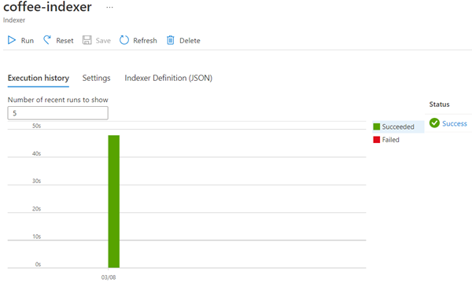
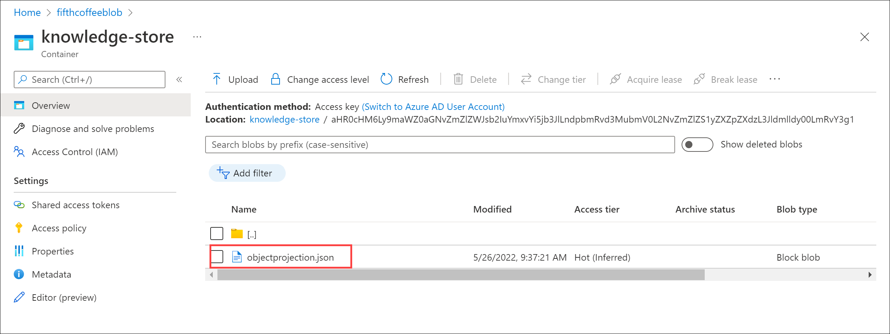
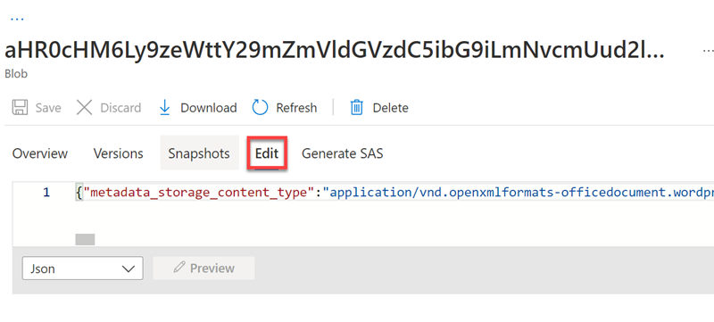

# Azure AI Search (UI)

## Explore um índice do Azure AI Search (UI)

Vamos imaginar que você trabalha para a Fourth Coffee, uma rede nacional de cafés. Você foi solicitado a ajudar a criar uma solução de mineração de conhecimento que facilite a busca de insights sobre as experiências dos clientes. Você decide criar um índice do Azure AI Search usando dados extraídos de avaliações de clientes.

Neste laboratório você irá:

- Criar recursos do Azure
- Extrair dados de uma fonte de dados
- Enriqueça os dados com habilidades de IA
- Utilize o indexador do Azure no portal do Azure
- Consulte seu índice de pesquisa
- Revise os resultados salvos em uma Loja de conhecimento

## Recursos do Azure necessários

A solução que você criará para o Fourth Coffee requer os seguintes recursos na sua assinatura do Azure:

- Um recurso **do Azure AI Search** , que gerenciará a indexação e a consulta.
- Um recurso **de serviços de IA do Azure** , que fornece serviços de IA para habilidades que sua solução de pesquisa pode usar para enriquecer os dados na fonte de dados com insights gerados por IA.

**Nota** Os recursos do Azure AI Search e dos serviços Azure AI devem estar no mesmo local!

- Uma **conta de armazenamento** com contêineres de blobs, que armazenará documentos brutos e outras coleções de tabelas, objetos ou arquivos.

## Crie um recurso *do Azure AI Search*

1. Entre no [portal do Azure](https://portal.azure.com/learn.docs.microsoft.com?azure-portal=true) .
1. Clique no botão **+ Criar um recurso** , pesquise *Azure AI Search* e crie um recurso **Azure AI Search** com as seguintes configurações:
   1. **Assinatura** : *sua assinatura do Azure* .
   1. **Grupo de recursos** : *selecione ou crie um grupo de recursos com um nome exclusivo* .
   1. **Nome do serviço** : *um nome exclusivo* .
   1. **Localização** : *Escolha qualquer região disponível* .
   1. **Nível de preços** : Básico
1. Selecione **Review + create** e depois de ver a resposta **Validation Success** , selecione **Create** .
1. Após a conclusão da implantação, selecione **Ir para o recurso** . Na página de visão geral do Azure AI Search, você pode adicionar índices, importar dados e pesquisar índices criados.

## Crie um recurso de serviços de IA do Azure

Você precisará provisionar um recurso **de serviços de IA do Azure** que esteja no mesmo local que seu recurso do Azure AI Search. Sua solução de pesquisa usará esse recurso para enriquecer os dados no armazenamento de dados com insights gerados por IA.

1. Retorne à página inicial do portal do Azure. Clique no botão **＋Criar um recurso** e pesquise os *serviços de IA do Azure* . Selecione **criar** um plano **de serviços de IA do Azure** . Você será levado a uma página para criar um recurso de serviços de IA do Azure. Configure-o com as seguintes configurações:
   1. **Assinatura** : *sua assinatura do Azure* .
   1. **Grupo de recursos** : *O mesmo grupo de recursos que seu recurso do Azure AI Search* .
   1. **Região** : *o mesmo local do recurso do Azure AI Search* .
   1. **Nome** : *Um nome exclusivo* .
   1. **Nível de preços** : Padrão S0
   1. **Ao marcar esta caixa, confirmo que li e compreendi todos os termos abaixo** : Selecionado
1. Selecione **Revisar + criar** . Depois de ver a resposta **Validation Passed** , selecione **Create** .
1. Aguarde a conclusão da implantação e visualize os detalhes da implantação.

## Crie uma conta de armazenamento

1. Retorne à página inicial do portal do Azure e selecione o botão **+ Criar um recurso** .
1. Procure *conta de armazenamento* e crie um recurso **de conta de armazenamento** com as seguintes configurações:
   1. **Assinatura** : *sua assinatura do Azure* .
   1. **Grupo de recursos** : *O mesmo grupo de recursos que os recursos do Azure AI Search e dos serviços Azure AI* .
   1. **Nome da conta de armazenamento** : *um nome exclusivo* .
   1. **Localização** : *Escolha qualquer localização disponível* .
   1. Padrão de **desempenho**
   1. **Redundância** : armazenamento localmente redundante (LRS)
1. Clique em **Revisar** e em **Criar** . Aguarde a conclusão da implantação e vá para o recurso implantado.
1. Na conta de Armazenamento do Azure que você criou, no painel de menu esquerdo, selecione **Configuração** (em **Configurações** ).
1. Altere a configuração de *Permitir acesso anônimo de Blob* para **Habilitado** e selecione **Salvar** .

## Carregar documentos para o armazenamento do Azure

1. No painel do menu esquerdo, selecione **Containers** .

   

1. Selecione **+ Contêiner** . Um painel do seu lado direito é aberto.
1. Insira as seguintes configurações e clique em **Criar** :
   1. **Nome** : Coffee-Reviews
   1. **Nível de acesso público** : Container (acesso de leitura anônimo para containers e blobs)
   1. **Avançado** : *sem alterações* .
1. Em uma nova guia do navegador, baixe as [avaliações de café compactadas](https://aka.ms/mslearn-coffee-reviews) em https://aka.ms/mslearn-coffee-reviewse extraia os arquivos para a pasta *de avaliações* .
1. No portal do Azure, selecione o contêiner *de avaliações de café* . No contêiner, selecione **Carregar** .

   

1. No painel **Carregar blob** , selecione **Selecionar um arquivo** .
1. Na janela do Explorer, selecione **todos** os arquivos na pasta *de avaliações* , selecione **Abrir** e, em seguida, selecione **Carregar** .

   

1. Depois que o upload for concluído, você poderá fechar o painel **Upload blob** . Seus documentos estão agora em seu contêiner de armazenamento *de avaliações de café .*

## Indexar os documentos

Depois de armazenar os documentos, você poderá usar o Azure AI Search para extrair insights dos documentos. O portal do Azure fornece um *assistente de importação de dados* . Com este assistente, você pode criar automaticamente um índice e um indexador para fontes de dados suportadas. Você usará o assistente para criar um índice e importar seus documentos de pesquisa do armazenamento para o índice do Azure AI Search.

1. No portal do Azure, navegue até o recurso Azure AI Search. Na página **Visão geral** , selecione **Importar dados** .

   

1. Na página **Conectar-se aos seus dados** , na lista **Fonte de Dados** , selecione **Azure Blob Storage** . Preencha os detalhes do armazenamento de dados com os seguintes valores:
   1. **Fonte de dados** : Armazenamento de Blobs do Azure
   1. **Nome da fonte de dados** : coffee-customer-data
   1. **Dados a extrair** : Conteúdo e metadados
   1. **Modo de análise** : Padrão
   1. **Cadeia de conexão** : \*Selecione **Escolha uma conexão existente** . Selecione sua conta de armazenamento, selecione o contêiner **de avaliações de café** e clique em **Selecionar** .
   1. **Autenticação de identidade gerenciada** : Nenhuma
   1. **Nome do contêiner** : *esta configuração é preenchida automaticamente depois que você escolhe uma conexão existente* .
   1. **Pasta Blob** : *deixe em branco* .
   1. **Descrição** : Avaliações sobre Fourth Coffee Shops.
1. Selecione **Próximo: Adicionar habilidades cognitivas (opcional)** .
1. Na secção **Anexar Serviços Cognitivos** , selecione o seu recurso de serviços Azure AI.
1. Na seção **Adicionar enriquecimentos** :
   1. Altere o **nome da qualificação** para **coffee-skillset** .
   1. Marque a caixa de seleção **Habilitar OCR e mesclar todo o texto no campo merged\_content** .

**Nota** É importante selecionar **Habilitar OCR** para ver todas as opções de campo enriquecido.

1. Certifique-se de que o **campo Dados de origem** esteja configurado como **merged\_content** .
1. Altere o **nível de granularidade de enriquecimento** para **Páginas (blocos de 5.000 caracteres)** .
1. Não selecione *Habilitar enriquecimento incremental*
1. Selecione os seguintes campos enriquecidos:

   |Habilidade Cognitiva|Parâmetro|Nome do campo|
   | :- | :- | :- |
   |Extraia nomes de locais| |Localizações|
   |Extraia frases-chave| |frases chave|
   |Detectar sentimento| |sentimento|
   |Gerar tags de imagens| |imagemTags|
   |Gere legendas de imagens| |legenda da imagem|

1. Em **Salvar enriquecimentos em um armazenamento de conhecimento** , selecione:
   1. Projeções de imagem
   1. Documentos
   1. Páginas
   1. Frases chave
   1. Entidades
   1. Detalhes da imagem
   1. Referências de imagem

      **Nota** Se aparecer um aviso solicitando uma **cadeia de conexão de conta de armazenamento** .

      

   1. Selecione **Escolha uma conexão existente** . Escolha a conta de armazenamento que você criou anteriormente.
   1. Clique em **+ Container** para criar um novo contêiner chamado **armazenamento de conhecimento** com o nível de privacidade definido como **Private** e selecione **Create** .
   1. Selecione o contêiner **de armazenamento de conhecimento** e clique em **Selecionar** na parte inferior da tela.
1. Selecione **projeções de blob do Azure: Documento** . Uma configuração para *o nome do contêiner* com as exibições preenchidas automaticamente do contêiner *de armazenamento de conhecimento* . Não altere o nome do contêiner.
1. Selecione **Próximo: Personalizar índice de destino** . Altere o **nome do índice** para **coffee-index** .
1. Certifique-se de que a **chave** esteja configurada como **metadata\_storage\_path** . Deixe **o nome do sugeridor** em branco e **o modo de pesquisa** preenchido automaticamente.
1. Revise as configurações padrão dos campos de índice. Selecione **filtrável** para todos os campos que já estão selecionados por padrão.

   

1. Selecione **Próximo: Criar um indexador** .
1. Altere o **nome do indexador** para **coffee-indexer** .
1. Deixe a **programação** definida como **Once** .
1. Expanda as **opções avançadas** . Certifique-se de que a opção **Base-64 Encode Keys** esteja selecionada, pois as chaves de codificação podem tornar o índice mais eficiente.
1. Selecione **Enviar** para criar a fonte de dados, o conjunto de habilidades, o índice e o indexador. O indexador é executado automaticamente e executa o pipeline de indexação, que:
   1. Extrai os campos de metadados do documento e o conteúdo da fonte de dados.
   1. Executa o conjunto de habilidades cognitivas para gerar campos mais enriquecidos.
   1. Mapeia os campos extraídos para o índice.
1. Volte à página de recursos do Azure AI Search. No painel esquerdo, em **Gerenciamento de pesquisa** , selecione **Indexadores** . Selecione o **indexador de café** recém-criado . Espere um minuto e selecione **↻ Atualize** até que o **Status** indique sucesso.
1. Selecione o nome do indexador para ver mais detalhes.

   

## Consultar o índice

Use o Search Explorer para escrever e testar consultas. O explorador de pesquisa é uma ferramenta incorporada no portal do Azure que oferece uma maneira fácil de validar a qualidade do seu índice de pesquisa. Você pode usar o Search Explorer para escrever consultas e revisar resultados em JSON.

1. *Na página Visão geral* do serviço de pesquisa , selecione **Explorador de pesquisa** na parte superior da tela.

   

1. Observe como o índice selecionado é o *índice de café* que você criou. Abaixo do índice selecionado, altere a *visualização* para **JSON view** .

   

No campo **do editor de consultas JSON** , copie e cole:

        Código      

        {

        `    `"search": "\*",

        `    `"count": true

        }

1. Selecione **Pesquisar** . A consulta de pesquisa retorna todos os documentos no índice de pesquisa, incluindo uma contagem de todos os documentos no campo **@odata.count** . O índice de pesquisa deve retornar um documento JSON contendo os resultados da pesquisa.
1. Agora vamos filtrar por localização. No campo **do editor de consultas JSON** , copie e cole:

        Código

        {

        ` `"search": "locations:'Chicago'",

        ` `"count": true

        }

1. Selecione **Pesquisar** . A consulta pesquisa todos os documentos no índice e filtra revisões com localização em Chicago. Você deveria ver 3no @odata.countcampo.
1. Agora vamos filtrar por sentimento. No campo **do editor de consultas JSON** , copie e cole:

        Código

        {

        ` `"search": "sentiment:'negative'",

        ` `"count": true

        }

1. Selecione **Pesquisar** . A consulta pesquisa todos os documentos no índice e filtra revisões com sentimento negativo. Você deveria ver 1no @odata.countcampo.

**Nota** Veja como os resultados são classificados por @search.score. Esta é a pontuação atribuída pelo mecanismo de pesquisa para mostrar o quão próximos os resultados correspondem à consulta fornecida.

1. Um dos problemas que podemos querer resolver é por que pode haver certas avaliações. Vamos dar uma olhada nas frases-chave associadas à avaliação negativa. O que você acha que pode ser a causa da revisão?

## Revise o armazenamento de conhecimento

Vamos ver o poder do armazenamento de conhecimento em ação. Ao executar o *assistente Importar dados* , você também criou um armazenamento de conhecimento. Dentro do armazenamento de conhecimento, você encontrará os dados enriquecidos extraídos pelas habilidades de IA que persistem na forma de projeções e tabelas.

1. No portal do Azure, navegue de volta para a sua conta de armazenamento do Azure.
1. No painel do menu esquerdo, selecione **Containers** . Selecione o contêiner **de armazenamento de conhecimento** .

   

1. Selecione qualquer um dos itens e clique no arquivo **objectprojection.json** .

   

1. Selecione **Editar** para ver o JSON produzido para um dos documentos do seu armazenamento de dados do Azure.

   
1. Selecione a localização atual do blob de armazenamento no canto superior esquerdo da tela para retornar à conta de armazenamento *Containers* .

   
1. Em *Containers* , selecione o contêiner *coffee-skillset-image-projection* . Selecione qualquer um dos itens.

   

1. Selecione qualquer um dos arquivos *.jpg* . Selecione **Editar** para ver a imagem armazenada no documento. Observe como todas as imagens dos documentos são armazenadas desta forma.

   

1. Selecione a localização atual do blob de armazenamento no canto superior esquerdo da tela para retornar à conta de armazenamento *Containers* .
1. Selecione **Navegador de armazenamento** no painel esquerdo e selecione **Tabelas** . Há uma tabela para cada entidade no índice. Selecione a tabela *coffeeSkillsetKeyPhrases* .

   Observe as frases-chave que o armazenamento de conhecimento conseguiu capturar do conteúdo das avaliações. Muitos dos campos são chaves, portanto você pode vincular as tabelas como um banco de dados relacional. O último campo mostra as frases-chave que foram extraídas pelo conjunto de habilidades.

## Considerações finais

    A ferramenta apresenta grandes funcionalidades para empresas que, desejam estar informatizadas e até mesmo para empresas que já estão; mas ainda tem muito retrabalho quando o assunto se trata da organização de documentos, o que pode tornar o trabalho um pouco cansativo e até mesmo perda de tempo para os colaboradores que poderiam estar focando sua atenção em outras atividades. O fato é que a utilização da ferramenta ajuda a evitar perda de dados, seja pelo desgaste do tempo que ocorre com papel ou até mesmo um sinistro que pode ocorrer na empresa.
    As empresas podem se beneficiar de vários recursos utilizando a ferramenta.